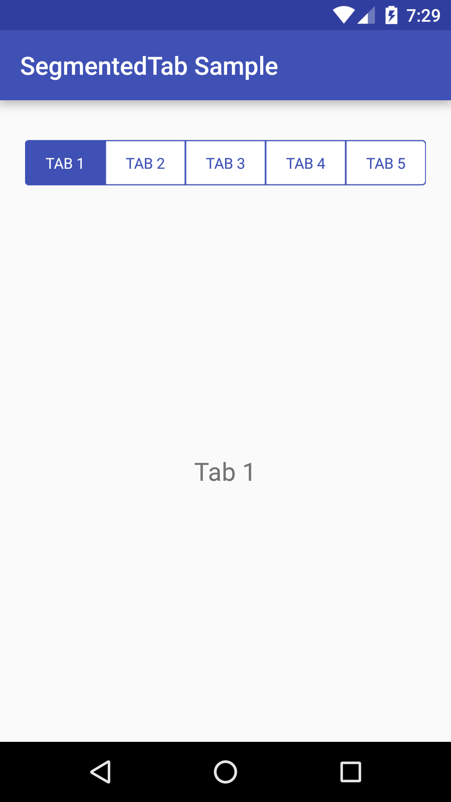

android-segmentedtab
===============

An Android library that bring segmented control style to TabLayout.



Target platforms
---

- API level 14 or later

Latest version
---

- Version 1.0.0  (APR. 12, 2016)

Usage
---

In order to use the library, there are 2 different options:

**1. Gradle dependency** (recommended)

 - 	Add the following to your `build.gradle`:
 ```gradle
repositories {
	    jcenter()
}

dependencies {
	   compile 'com.marlon.android.widget:segmented-tab:1.0.0'
}
```

**2. Maven**
- Add the following to your `pom.xml`:

 ```xml
<dependency>
      <groupId>com.marlon.android.widget</groupId>
      <artifactId>segmented-tab</artifactId>
      <version>1.0.0</version>
      <type>pom</type>
</dependency>
```

# Sample usage

```xml
   <com.marlon.android.widget.SegmentedTab
        android:id="@+id/segmentedTab"
        android:layout_width="match_parent"
        android:layout_height="60dp"
        android:layout_marginTop="20dp"
        app:tabSelectedColor="@color/colorPrimary"
        app:tabUnselectedColor="@android:color/white"
        app:titleColor="@color/test_tab"
        app:titleFontPath="fonts/roboto_regular.ttf" />
```

## Customization

You can customize the component according with attributes shown below

| Attribute             | Description   |
| ----------------------|:-------------:| 
| app:tabSelectedColor  | It is optional. But if you want to customize you must be definy a simple color | 
| app:tabUnselectedColor| It is optional. But if you want to customize you must be definy a simple color | 
| app:titleColor        | It is optional. But if you want to customize you must to definy a ColorStateList | 
| app:titleFontPath     | It is optional. But if you want to customize the font you must to set a path to the font file |

License
---

	Copyright (c) 2016 Marlon Mafra

    Licensed under the Apache License, Version 2.0 (the "License");
    you may not use this file except in compliance with the License.
    You may obtain a copy of the License at

    http://www.apache.org/licenses/LICENSE-2.0

    Unless required by applicable law or agreed to in writing, software
    distributed under the License is distributed on an "AS IS" BASIS,
    WITHOUT WARRANTIES OR CONDITIONS OF ANY KIND, either express or implied.
    See the License for the specific language governing permissions and
    limitations under the License.

